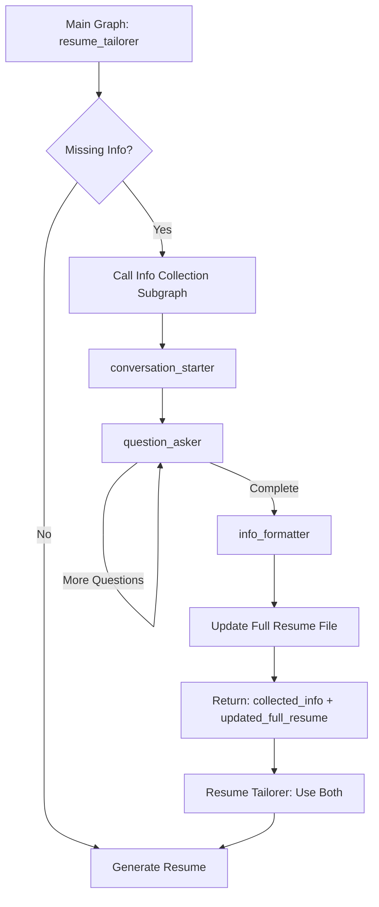

# Subgraph Architecture: Info Collection

## Overview

The resume tailoring system uses a **subgraph architecture** to handle user conversations for collecting missing resume information. This provides clean separation between resume processing logic and conversation management, while ensuring the full resume is always kept up-to-date.

## Architecture

### Main Graph
- **State**: `GraphState` (no conversation messages, always current full resume)
- **Purpose**: Resume analysis and tailoring pipeline
- **Nodes**: `file_loader` → `job_analyzer` → `resume_screener` → `resume_tailorer`

### Info Collection Subgraph
- **State**: `InfoCollectionState` (with conversation messages)
- **Purpose**: Manage conversations to collect missing information AND update full resume
- **Nodes**: `conversation_starter` → `question_asker` → `info_formatter`

## Flow



## Key Responsibilities

### Info Collection Subgraph
1. **Conversation Management**: Handle multi-turn user conversations
2. **Information Collection**: Gather missing resume details
3. **Full Resume Update**: Integrate new information into persistent full resume file
4. **Dual Output**: Return both formatted collected info AND updated full resume content

### Resume Tailorer
1. **Gap Analysis**: Identify missing information needs
2. **Subgraph Coordination**: Call info collection when needed
3. **Immediate Use**: Use collected info for current tailoring
4. **State Consistency**: Use updated full resume content for tailoring

## State Management

### Main Graph State (`GraphState`)
```python
{
    "user_id": str,
    "job_id": str,
    "original_resume": str,        # User's base resume (unchanged)
    "job_description": str,
    "job_strategy": str,
    "recruiter_feedback": str,
    "tailored_resume": str,
    "error": Optional[str]
    # NO messages field - keeps state clean
    # NO stale full resume - always uses current from file/subgraph
}
```

### Subgraph State (`InfoCollectionState`)
```python
{
    "missing_info_requirements": str,     # Input from main graph
    "user_id": str,
    "messages": List[Message],            # Conversation history
    "collected_info": Dict[str, Any],     # Structured responses
    "remaining_questions": List[str],     # Questions to ask
    "final_collected_info": str,          # Formatted output for tailoring
    "updated_full_resume": str,           # Updated full resume content
    "is_complete": bool,
    "error": Optional[str]
}
```

## Data Flow Benefits

### ✅ **No Stale State**
- Main graph never holds outdated full resume content
- Resume tailorer always uses current full resume (from file or subgraph)
- Subsequent sessions automatically have access to all collected information

### ✅ **Clean Separation**
- Info collection owns: conversation + persistence + full resume updates
- Resume tailorer owns: analysis + gap identification + resume generation
- Main graph owns: pipeline orchestration + current session state

### ✅ **Dual Output Strategy**
- **Immediate Use**: Collected info used right away for current tailoring
- **Persistent Learning**: Full resume updated for future sessions
- **Consistency**: Both outputs come from same subgraph execution

## Error Handling & Resilience

### Graceful Degradation
- If full resume update fails: session continues with collected info
- If subgraph fails: resume tailorer works with available information
- If collection incomplete: partial information still useful

### Atomic Operations
1. Collect all information through conversation
2. Format collected information
3. Update full resume file (last step)
4. Return both outputs together

## Client Interaction

### Transparent to Client
```python
try:
    result = await main_graph.ainvoke(state)
    # No interaction needed - resume generated
except GraphInterrupt as interrupt:
    # Handle conversation (from info collection subgraph)
    current_state = interrupt.value
    
    while True:
        try:
            # Show AI message, get user response
            user_input = get_user_input(current_state["messages"])
            result = await main_graph.ainvoke(current_state, input=user_input)
            break  # Conversation complete, resume generated
        except GraphInterrupt as next_interrupt:
            current_state = next_interrupt.value
            continue  # More conversation needed
```

### Key Benefits
1. **Single Interface**: Client only calls main graph
2. **Transparent Interrupts**: GraphInterrupts bubble up from subgraph
3. **Automatic Updates**: Full resume improvements happen transparently
4. **Session Continuity**: Current session gets immediate benefit of collected info

## Future Extensibility

This pattern supports:
- **Multiple Info Types**: Skills assessment, experience validation, project details
- **Cross-Node Collection**: Other nodes (resume_screener) can also collect info
- **Complex Conversations**: Branching questions, validation loops, clarifications
- **External Integration**: LinkedIn import, portfolio analysis, skill verification
- **Learning Systems**: ML models trained on successful collection patterns

## Testing Strategy

### Unit Tests
- Test subgraph nodes independently
- Mock file operations for isolated testing
- Verify conversation flow logic

### Integration Tests
- Test main graph with mocked subgraph
- Verify state transitions and data flow
- Test error handling and graceful degradation

### E2E Tests
- Test full conversation flows with real file operations
- Verify full resume updates persist correctly
- Test concurrent session handling

### Client Tests
- Test interrupt handling patterns
- Verify transparent subgraph operation
- Test conversation completion detection 