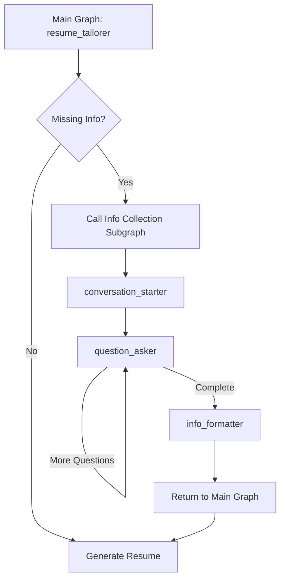

# Subgraph Architecture: Info Collection

## Overview

The resume tailoring system uses a **subgraph architecture** to handle user conversations for collecting missing resume information. This provides clean separation between resume processing logic and conversation management.

## Architecture

### Main Graph
- **State**: `GraphState` (no conversation messages)
- **Purpose**: Resume analysis and tailoring pipeline
- **Nodes**: `file_loader` → `job_analyzer` → `resume_screener` → `resume_tailorer`

### Info Collection Subgraph
- **State**: `InfoCollectionState` (with conversation messages)
- **Purpose**: Manage conversations to collect missing information
- **Nodes**: `conversation_starter` → `question_asker` → `info_formatter`

## Flow



## Client Interaction

### Key Benefits
1. **Single Interface**: Client only calls main graph
2. **Transparent Interrupts**: GraphInterrupts bubble up from subgraph
3. **State Isolation**: Conversation state separate from main processing
4. **Automatic Routing**: LangGraph handles subgraph resumption

### Client Code Pattern
```python
try:
    result = await main_graph.ainvoke(state)
    # No interaction needed
except GraphInterrupt as interrupt:
    # Handle conversation (could be from any subgraph)
    current_state = interrupt.value
    
    while True:
        try:
            # Show AI message, get user response
            user_input = get_user_input(current_state["messages"])
            result = await main_graph.ainvoke(current_state, input=user_input)
            break  # Conversation complete
        except GraphInterrupt as next_interrupt:
            current_state = next_interrupt.value
            continue  # More conversation needed
```

## State Management

### Main Graph State (`GraphState`)
```python
{
    "user_id": str,
    "job_id": str,
    "original_resume": str,
    "job_description": str,
    "job_strategy": str,
    "recruiter_feedback": str,
    "tailored_resume": str,
    "error": Optional[str]
    # NO messages field
}
```

### Subgraph State (`InfoCollectionState`)
```python
{
    "missing_info_requirements": str,  # Input from main graph
    "user_id": str,
    "messages": List[Message],         # Conversation history
    "collected_info": Dict[str, Any],  # Structured responses
    "remaining_questions": List[str],  # Questions to ask
    "final_collected_info": str,       # Output to main graph
    "is_complete": bool,
    "error": Optional[str]
}
```

## Conversation Flow

1. **Analysis**: Main graph identifies missing information
2. **Subgraph Call**: Creates subgraph state with requirements
3. **Conversation Start**: Subgraph asks first question
4. **User Interaction**: GraphInterrupt → Client handles → Resume
5. **Question Loop**: Continue until all information collected
6. **Formatting**: Structure collected info for resume tailoring
7. **Return**: Formatted info goes back to main graph
8. **Resume Generation**: Main graph uses all available information

## Error Handling

- **Subgraph Errors**: Contained within subgraph state
- **Main Graph Errors**: Handled by main graph error system
- **Interrupt Errors**: Client handles conversation failures
- **Graceful Degradation**: System works with partial information

## Extensibility

This pattern can be extended for:
- Multiple conversation types (skills assessment, experience validation)
- Different subgraphs for different nodes (resume_screener could also collect info)
- Complex conversation flows (branching questions, validation loops)
- Integration with external systems (LinkedIn, portfolio sites)

## Testing

- **Unit Tests**: Test subgraph nodes independently
- **Integration Tests**: Test main graph with mocked subgraph
- **E2E Tests**: Test full conversation flows
- **Client Tests**: Test interrupt handling patterns 